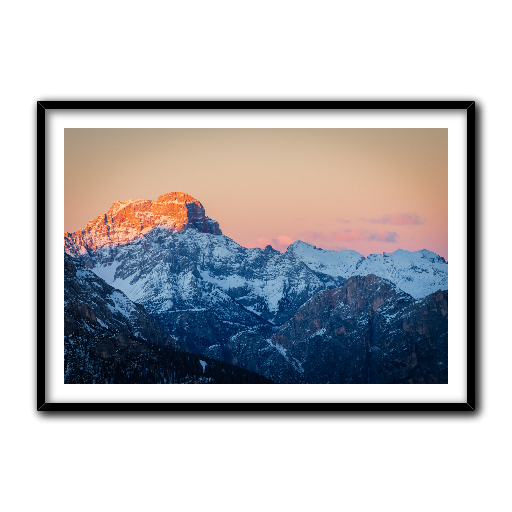
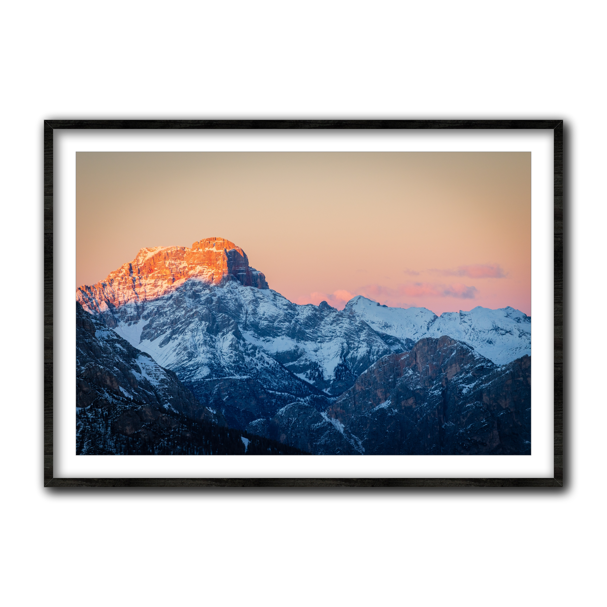
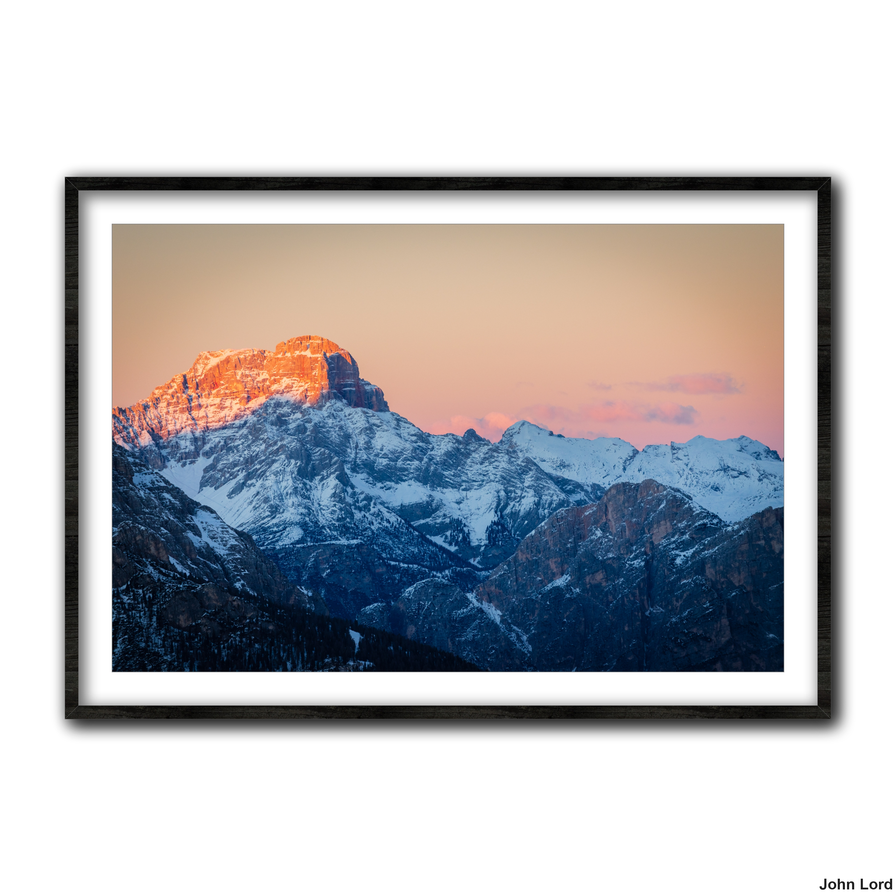

# fineart-prints-preview-creator
 A simple program to create a nice wall art preview of a given image. It returns a picture containing your input print on a wall mounted canvas.
 
 [](https://github.com/Elius94/fineart-prints-preview-creator)

 Create Fine Art Previewwallpreview
## Usage: wallpreview [options] <image>wallpreview
Options:
-   *--help* Print this help message
-   *--version* Print the version of this tool
-   *--verbose* Print verbose output
-   *--size <size>* The size of the image to be printed on the canvas. The size is a percentage (0-1) of the image size.
-   *--paddings <paddings>* The paddings of the frame. The paddings are a percentage (0-1) of the image size.
-   *--padding-color <color>* The color of the padding around the image. The color is a hexadecimal value.
-   *--frame-color <color>* The color of the frame. The color can be a hexadecimal value or a color name.
-   *--frame-type <frame-type>* The type of frame to be used. The frame type can be one of the following: 'no_frame', 'panel', 'canvas', 'solid' and 'nice'.
-   *--pattern <pattern>* The pattern to be used to fill the frame. The pattern is a path to an image file.
-   *--thickness <thickness>* The thickness of the frame. The thickness is a percentage (0-1) of the image size.
-   *--signature <signature>* The signature to be used to fill the frame. The signature is for example the name of the photographer.
-   *--signature-size <size>* The size of the signature. The size is a number. [default: 30] 
-   *--signature-font <font>* The font of the signature. The font is the installed font name. [default: Arial]
-   *--signature-align <align>* The alignment of the signature. The alignment is one of the following: 'left', 'center' and 'right'. [default: right]
-   *--dir <dir>* The directory where the output files will be saved.
-   *--output-size <size>* The size of the output image. The returned image is a square.
-   *--output-ratio <ratio>* The ratio of the output image. The ratio is a number. [default: 1] and can be one of the following: '1x1', '4x3', '3x4', '16x9', '9x16', '5x4', '4x5'.

## Examples:
wallpreview --verbose image.png
wallpreview path/to/image.png
```sh
wallpreview --pattern "./test/darkwood.jfif" --frame-type "nice" --dir "C:\\Users\\Mario\\Downloads\\test" --creator-signature "John Lord" --verbose --signature-size 50
```

## In particular:

Example input image:


Giving only the image path.

And executing this command:
```sh
wallpreview /path/to/image.png
```
The output image is this:


### --pattern
Giving a path to a pattern image, the program will fill the frame with the pattern.

And executing this command:
```sh
wallpreview --pattern "./test/darkwood.jfif" --frame-type "nice" /path/to/image.png
```
The output image is this:


### --signature
Giving a signature, the program will fill the frame with the signature.

Executing this command:
```sh
wallpreview --pattern "./test/darkwood.jfif" --frame-type "nice" --creator-signature "John Lord" --signature-size 50 .\test\test_image.jpg
```
The output image is this:


## execute with node

```sh 
npm install
node wallpreview.js --help
```

## compile to executable

You can do it using pkg:

```sh 
npm i -g pkg
```

Then: 

```sh 
pkg app.js
```

Automatic compilation with npm scripts:

```sh 
npm install
npm install -g pkg
npm run build-windows
```

## License

MIT License (MIT) Copyright (c) 2022 Elia Lazzari <elius94>
